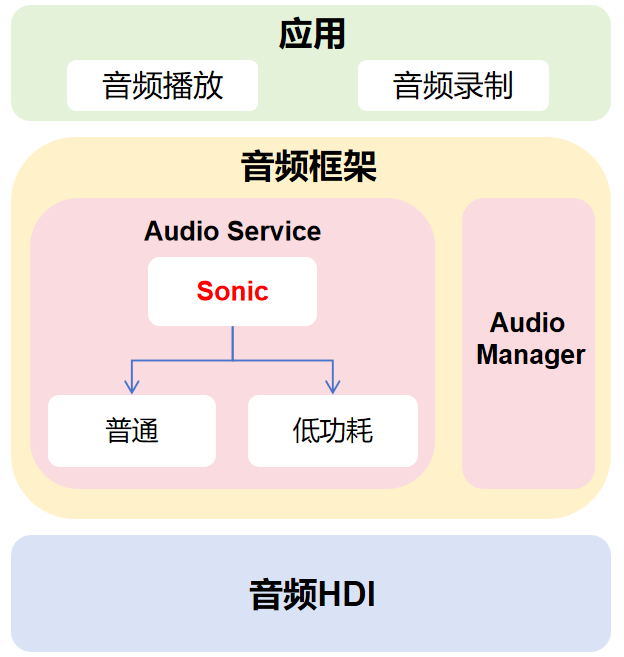

# third_party_sonic

## 使用场景

Sonic是一个用于音频变速的算法，可以实现音频变速不变调、变调不变速、同时变速变调等基本音频处理，尤其对2倍以上的变速进行了优化。Sonic包含了C和Java两种实现，main.c和main.java分别为两者的简单使用示例。

## 架构说明


在OpenHarmony系统中，sonic继承在音频服务中，通过音频服务提供接口，应用可以调用相关接口实现音频变速播放。
相关接口为setSpeed与getSpeed, 详细说明参考链接: https://gitee.com/openharmony/docs/blob/master/zh-cn/application-dev/reference/apis-audio-kit/js-apis-audio.md

## 目录结构

```
third_party_sonic/
├── debian/             # Debian系统源码
├── samples/            # 音频样例
├── Main.java           # Java使用示例
├── main.c              # C使用用例
├── sonic.c             # C音频变速源码
├── sonic.h             # C音频变速源码
├── Sonic.java          # JAVA音频变速源码
├── wave.c              # C音频变速源码
├── wave.h              # C音频变速源码
├── BUILD.gn            # 鸿蒙系统构建脚本
├── bundle.json         # 鸿蒙系统构建脚本
├── Makefile            # 编译脚本
├── README_zh.md        # 安装使用方法
├── README_en.md        # 安装使用方法
├── COPYING             # 声明许可证
└── LICENSE             # 声明许可证
```

## OpenHarmony对于sonic的适配
sonic引入openharmony的thirdparty目录下， 使用OpenHarmony中依赖部件的方式进行编译。

1. 主干代码下载

```
repo init -u https://gitee.com/openharmony/manifest.git -b master --no-repo-verify
repo sync -c
repo forall -c 'git lfs pull'
```

2. 在使用的模块进行依赖

```
deps = [ "//third_party/sonic:sonic" ]
```

3. 预处理

```
./build/prebuilts_download.sh
```
4. 编译

```
./build.sh --product-name rk3568 --ccache
```

## 许可证

本项目使用Apache 2.0许可证。请参阅LICENSE文件以获取更多详细信息。